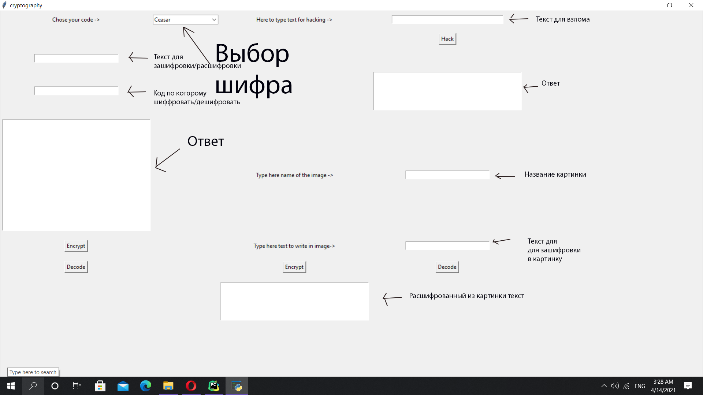

# Как  пользоваться: #
 + В первое поле набрать фразу котору хотелось бы зашифровать 
или расшифровать
 + Во второе поле ввести код с который это хочется сделать
 + Нажать кнопку соответственно тому, что хотите сделать

# Как взламывать: #
 + Набрать текст в поле рядом с подписью
 + Нажать кнопку
# Как шифровать в картинки bmp или png: #
 + Набрать название картинки в подписанное для этого поле
 + Набрать текст для шифрование
 + Нажать кнопку Encrypt под надписью с указанием куда набирать текст
# Как рассшифровыввать текст из картинки: #
 + Набрать название картинки в подписанное для этого поле
 + Нажать кнопку Decode под полем для набора текста
 + Ответ появится в поле под кнопкой Encrypt 





# Как запускать: #
```
git clone https://github.com/Nerubes/review1.git
sudo apt install python3-opencv
sudo apt install python3-tk
python main.pyw
```

